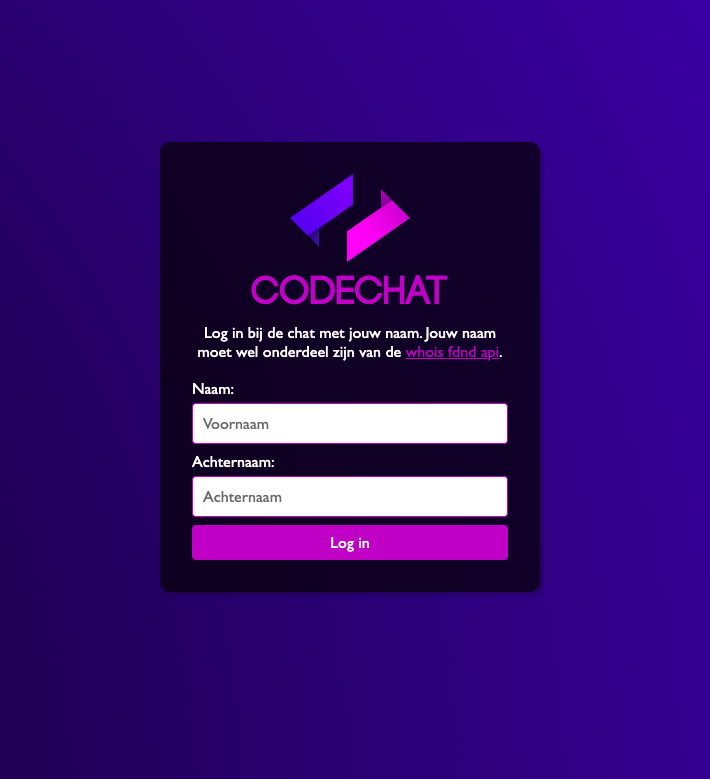
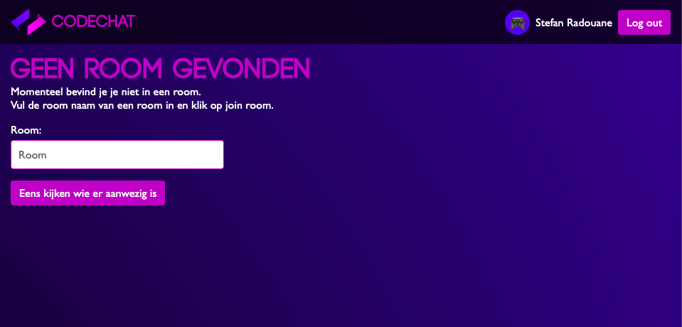
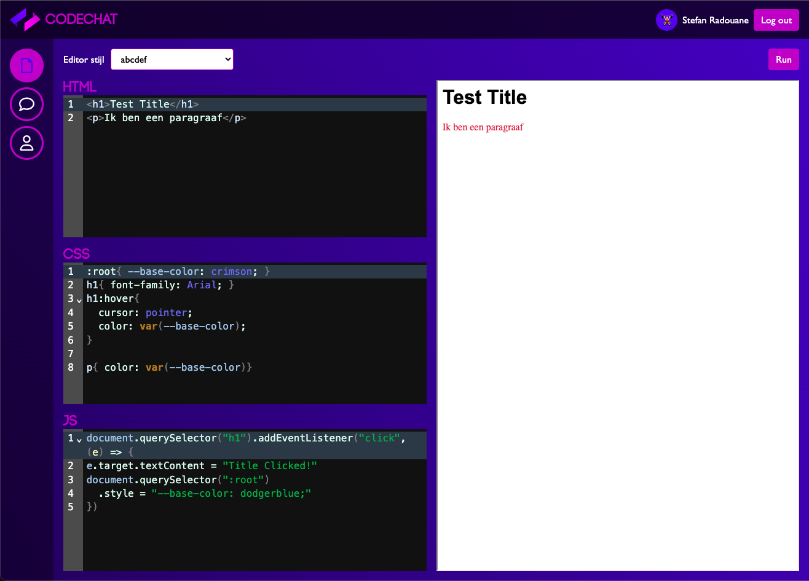
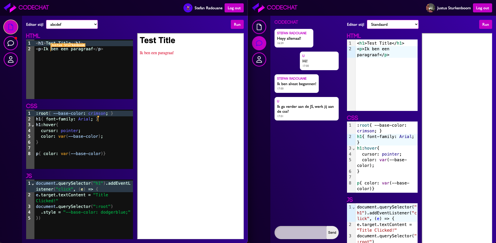
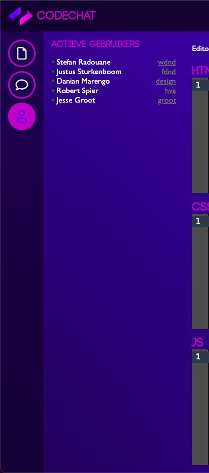

# 💬 Code Chat

Repository voor de Code Chat applicatie.

Gemaakt door Stefan Radouane

Minor Web design and Development - 2022/2023

Real Time Web - Respository - Minor: Web Design and Development

<!-- ## Inhoudsopgave

- [ℹ️ Over dit project](#ℹ️-over-dit-project)
- [📥 Project installatie](#📥-project-installatie)
- [🧠 Client-server rendering](#🧠-client-server-rendering)
- [👷 Service worker](#👷-service-worker)
- [🚑 App optimalisatie](#🚑-app-optimalisatie)
- [📝 Criteria](#📝-criteria) -->

## ℹ️ Over dit project

Dit project is gemaakt voor het vak Real Time Web. Bij dit vak is het de bedoeling dat ik een real time connectie maak tussen verschillende clients. De app moet uiteindlijk gedeployed worden op [Adaptable](https://adaptable.io). Ik maak bij dit project gebruik van twee soorten real time verbindingen, namelijk: WebSockets en WebRTC. De app die ik ga maken is een code chat app. De gebruikers kunnen met elkaar chatten en en code schrijven. De app is gemaakt met Node.js en Express. De app is gemaakt met de MVC structuur. De belangrijkste modules/packages die de app gebruikt zijn:

- [Node.js](https://nodejs.org/en/) | Server
- [Express](https://expressjs.com/) | Server
- [EJS](https://ejs.co/) | Templating
- [Passport](http://www.passportjs.org/) | Authenticatie
- [Socket.io](https://socket.io/) | Socket
- [Yjs](https://www.npmjs.com/package/yjs) | WebRTC
- [Y-WebRTC](https://www.npmjs.com/package/y-webrtc) | WebRTC
- [CodeMirror](https://codemirror.net/) | Editor

## 📥 Project installatie

Om dit project lokaal te runnen is moet je de volgende stappen achter elkaar uitvoeren in de terminal.

1. Clone repository met `git clone <repo-url>`
2. Navigeer naar de juiste map `cd <repo-naam>`
3. Installeer dependencies met `npm install` of `npm i`
4. Bouw de bestanden met `npm run build`
5. Start de server met `npm run start`
6. Open de app in de browser op `localhost:<port>` (standaard port is 4242)

### 🚧 Onderhoud

Om dit project te kunnen onderhouden is het de bedoeling dat je de bestanden opnieuw bouwt met het volgende command `npm run build`.

## 📱 Hoe werkt de app?

De app bestaat uit een aantal features. Ik heb de volgende features gemaakt, de features zijn op volgorde van de flow van de app:

- Login met passport.js
- Room selectie
- Code editor
- Chat
- Actieve gebruikers

### Login met passport.js

De gebruiker kan inloggen met passport.js. De gebruiker kan inloggen met zijn/haar voor- en achternaam als deze onderdeel uitmaakt van [whois fdnd api](https://whois.fdnd.nl/admin). De gebruiker wordt gecheckt en als de gebruiker gevonden wordt in de database dan wordt er een sessie aangemaakt in zowel de server als socket. De gebruiker wordt dan doorgestuurd naar de room selectie pagina. Ik heb hiervoor de authenticatie stategie `local` gebruikt. De gebruiker kan ook uitloggen. De gebruiker wordt dan uitgelogd uit de server en socket. De gebruiker wordt dan doorgestuurd naar de login pagina.

Om een sessie aan te maken in de server en socket heb ik gebruik gemaakt van de volgende code:

```javascript
// path: server.js

app.use(flash());

const sessionMiddleware = session({
  secret: "changeit",
  resave: false,
  saveUninitialized: false,
});

app.use(sessionMiddleware);
app.use(passport.initialize());
app.use(passport.session());

// convert a connect middleware to a Socket.IO middleware
const wrap = (middleware) => (socket, next) =>
  middleware(socket.request, {}, next);

io.use(wrap(sessionMiddleware));
io.use(wrap(passport.initialize()));
io.use(wrap(passport.session()));

io.use((socket, next) => {
  if (socket.request.user) {
    next();
  } else {
    next(new Error("unauthorized"));
  }
});
```

```javascript
// path: config/passport.js

// Code van de locale strategie
const LocalStrategy = new localStrategy(
  {
    usernameField: "name",
    passwordField: "surname",
  },
  (name, surname, done) => {
    fetch(
      `https://stefan-the-api-middleman.netlify.app/.netlify/functions/getUser/?name=${name}&surname=${surname}`
    )
      .then((res) => res.json())
      .then((users) => {
        // Geen gebruiker gevonden
        if (users.data.length === 0) {
          // Return flash message
          return done(null, false, {
            message: "Fout wachtwoord",
          });
          // Return user
        } else done(null, users.data[0]);
      })
      // Error
      .catch((err) => {
        return done(null, false, {
          message: "Probeer het nogmaals",
        });
      });
  }
);

passport.serializeUser((user, cb) => {
  cb(null, user);
});

passport.deserializeUser((user, cb) => {
  cb(null, user);
});

passport.use(LocalStrategy);
```

> In de code kun je zien dat het endpoint een serverless functie die ik heb gemaakt en deployed op netlify. De functie haalt de gebruiker op uit de database.

Voor deze inlog functie heb ik de volgende modules/packages gebruikt:

- [Passport](http://www.passportjs.org/) | Authenticatie
- [Passport-local](http://www.passportjs.org/packages/passport-local/) | Authenticatie
- [socket.io](https://socket.io/) | Socket
- [express-session](https://www.npmjs.com/package/express-session) | Session
- [express-flash](https://www.npmjs.com/package/express-flash) | Flash messages
- [node-fetch](https://www.npmjs.com/package/node-fetch) | Fetch



### Room selectie

De gebruiker kan een room joinen door de naam van de room in te typen. De room wordt bepaald op basis van de query. Een voorbeeld hiervan is `?room=test`, de huidige roomnaam is dan test. Ik heb de volgende code gebruikt om te checken of de gebruiker in een room zit.

```javascript
res.render("pages/index", { room: req.query.room });
```

Dit wordt vervolgens afgehandeld in de ejs template.

```javascript
    <% if (room) { %>
    <%- include('../partials/users') %>
    <%- include('../partials/chat') %>
    <%- include('../partials/code-editor') %>
    <% } else { %>
    <%- include('../partials/roomselect') %>
    <% } %>
```

Ik heb de volgende modules/packages gebruikt voor de room selectie:

- [Express](https://expressjs.com/) | Server
- [EJS](https://ejs.co/) | Templating



### Code editor

De gebruiker kan code typen in de code editor. De code wordt realtime gesynchroniseerd met de andere gebruikers in de room. De code wordt gesynchroniseerd met [Yjs](https://www.npmjs.com/package/yjs) en [Y-WebRTC](https://www.npmjs.com/package/y-webrtc). Ik heb de volgende code gebruikt om de code te synchroniseren. Dit gedeelte bestaat uit drie onderdelen. Dit zijn:

- De code editor
- De Yjs document
- De Y-WebRTC provider

Ik heb gebruik gemaakt van CodeMirror voor de code editor. Ik heb de volgende code gebruikt om de code editor te initialiseren. Ik heb hiervoor een editor functie gemaakt die

```javascript
// path: src/js/editor.js

// maak een javascript editor aan
editor(`${name.name} ${name.surname}`, "js", theme, room);
```

Deze functie wordt aangeroepen vanuit een ander bestand.

```javascript
// path: src/js/editor-editor.js

const editor = (username, lang, theme, lobby) => {
  const ytext = ydocs[lang].getText(`${lobby}-${lang}`); // ydocs[lang] = new Y.Doc()
  const provider = providers[lang]; // providers[lang] = new WebrtcProvider("js", ydocs["js"], {})

  // Create a random color for the user and set it as the local state field "user"
  provider.awareness.setLocalStateField("user", {
    name: username,
    color: userColor.color,
    colorLight: userColor.light,
  });

  // Create a new editor view
  const editorState = (lang) => {
    return EditorState.create({
      doc: ytext.toString(), // ytext = ydocs[lang].getText(`${lobby}-${lang}`)
      extensions: [
        keymap.of([...yUndoManagerKeymap]), // yUndoManagerKeymap = [undo, redo]
        basicSetup, // basicSetup = [history(), keymap(), lineNumbers(), autocompletion()]
        syntaxHighlights[lang], // syntaxHighlights[lang] = javascript() | css() | html()
        EditorView.lineWrapping, // lineWrapping = true
        yCollab(ytext, provider.awareness), // allow collaboration
        theme == "default" ? [] : filteredThemes[theme], // select theme
      ],
    });
  };

  // Return editor with settings
  return new EditorView({
    state: editorState(lang),
    parent: document.querySelector(`.editor--${lang}`),
  });
};
```

> De code editor wordt geïnitialiseerd met de code van de gebruiker. De code wordt gesynchroniseerd met de andere gebruikers in de room.

Ik heb de volgende modules/packages gebruikt voor de code editor:

- [CodeMirror](https://codemirror.net/) | Code editor
- [HTML language support](https://www.npmjs.com/package/@codemirror/lang-html) | Code editor
- [CSS language support](https://www.npmjs.com/package/@codemirror/lang-css) | Code editor
- [Javascript language support](https://www.npmjs.com/package/@codemirror/lang-js) | Code editor
- [y-codemirror.next](https://www.npmjs.com/package/y-codemirror.next) | Code editor undomanager & collab
- [keymap](https://www.npmjs.com/package/@codemirror/state) | Code editor keymap
- [Yjs](https://www.npmjs.com/package/yjs) | WebRTC document
- [Y-WebRTC](https://www.npmjs.com/package/y-webrtc) | WebRTC



### Chat

De gebruiker kan chatten met de andere gebruikers in de room. De chat wordt realtime gesynchroniseerd met de andere gebruikers in de room. De chat wordt gesynchroniseerd met [socket.io](https://socket.io/). Ik heb de volgende code gebruikt om de chat te synchroniseren. Dit gedeelte bestaat uit twee onderdelen. Dit zijn:

- De chat
- De chat geschiedenis
- Chat melding

Ik heb de volgende code gebruikt voor het versturen van meldingen en ontvangen van de melding op de server.

<!-- Ik heb de volgende code gebruikt om de chat te initialiseren. Ik heb hiervoor een chat functie gemaakt die -->

```javascript
document.getElementById("chat-form")?.addEventListener("submit", (event) => {
  event.preventDefault();
  if (input.value) {
    socket.emit("message", {
      message: input.value,
      username: usernameSpan.innerText,
      date: new Intl.DateTimeFormat("nl-NL", {
        hour: "numeric",
        minute: "numeric",
      }).format(Date.now()),
      room: new URL(window.location.href).searchParams.get("room"),
    });
    input.value = "";
  }
});
```

> Het bericht wordt verzonden naar de server in het volgende formaat.

```JSON
{
  "message": "Dit is een bericht",
  "username": "Voornaam Achternaam",
  "date": "12:00",
  "room": "room"
}
```

Vervolgens komt deze melding binnen op de server.

```javascript
// path: server.js
socket.on("message", (message) => {
  while (history[message.room]?.length > historySize) {
    history.shift();
  }
  history[message.room] = !history[message.room] ? [] : history[message.room];
  history[message.room].push(message);

  io.emit("message", message);
});
```

> In de code staat dat op het moment dat een bericht wordt verzonden deze message wordt opgeslagen in de history van de chat. Vervolgens wordt de message verzonden naar de connecties.

Ik heb de volgende code gebruikt voor het tonen van het bericht.

```javascript
socket.on("message", (message) => {
  addMessage(message);

  const isOpen = document.querySelector(".content--chat");
  if (!isOpen) {
    const chatTab = document.querySelector("[data-nav-control='chat']");
    chatTab.classList.add("nav__list-control--new-message");
  }
});

function addMessage(message) {
  const messageN = message.username;
  const usernameN = usernameSpan.innerText;
  const isSelf = messageN == usernameN;
  const className = isSelf ? "message message--own" : "message";

  chat.appendChild(
    Object.assign(document.createElement("li"), {
      classList: className,
      innerHTML: messageToHtml(message, isSelf),
    })
  );
  chat.scrollTop = chat.scrollHeight;
}
```



#### Chatgeschiedenis

Om de juiste chatgeschiedenis naar de client te sturen heb ik de volgende functie geschreven.

```javascript
// path: server.js

socket.on("whoami", (cb) => {
  cb(socket.request.user ? socket.request.user : "");

  socket.emit(
    "history",
    history[new URL(socket.handshake.headers.referer).searchParams.get("room")]
  );
});
```

> Het whoami event wordt door de server verzonden als er er een nieuwe connectie is. De server stuurt de chatgeschiedenis naar de client.

Vervolgens wordt de chatgeschiedenis ontvangen door de client en wordt de chatgeschiedenis getoond.

```javascript
// path: src/script.js
socket.on("history", (history) => {
  history?.forEach((message) => {
    addMessage(message);
  });
});

socket.emit("whoami", (user) => {
  usernameSpan.innerText = `${user.name} ${user.surname}`;
  createAvatar(user.avatar, avatarImg);
});

/**
 * Replace the avatar image source or to an emoji
 * @param {String | String[]} avatar
 * @param {Element} avatarImg
 */
export function createAvatar(avatar, avatarImg) {
  if (avatar.startsWith(`https://`) || avatar.startsWith(`http://`)) {
    avatarImg.src = avatar;
  } else {
    const parsedEmoji = JSON.parse(avatar.replaceAll(`'`, `"`));
    const emoji = parsedEmoji[Math.floor(Math.random() * parsedEmoji.length)];
    avatarImg.parentElement.replaceChild(
      Object.assign(document.createElement("div"), {
        classList: avatarImg.classList,
        innerHTML: emoji,
      }),
      avatarImg
    );
  }
}
```

### Actieve gebruikers van de app

De actieve gebruikers van de app worden getoond in een eigen tab. Je kan van de gebruiker zien in welke lobby hij/zij zit en naar deze lobby toe navigeren.

```javascript
// path: server.js

io.fetchSockets().then((data) => {
  io.emit(
    "activeUsers",
    data.map((ios) => {
      return {
        id: ios.id,
        user: ios.request.user,
        room: new URL(ios.handshake.headers.referer).searchParams.get("room"),
      };
    })
  );
});
```

> In de code kan je zien dat de server de actieve gebruikers ophaalt en deze naar de client stuurt.

```javascript
// path: src/script.js

socket.on("activeUsers", (users) => {
  const uniqueArray = users.filter((item, index, self) => {
    return (
      index ===
      self.findIndex((obj) => {
        return obj.userName === item.userName && obj.room === item.room;
      })
    );
  });

  document.querySelector("[data-users]")
    ? Array.from(document.querySelector("[data-users]")?.children).forEach(
        (child) => {
          child.remove();
        }
      )
    : undefined;

  uniqueArray.forEach((user) => {
    if (user.room)
      document.querySelector("[data-users]")?.appendChild(
        Object.assign(document.createElement("li"), {
          classList: "connection connection--connected",
          innerHTML: `${user.user.name} ${user.user.surname} <a class="connection__room" href="/?room=${user.room}">${user.room}</a>`,
        })
      );
  });
});
```

> In deze code kan je zien dat de client het event opvangt en de gebruikers eerst omzet in een unieke array. Deze unieke Array wordt gemaakt, omdat er voor elke gebruiker twee connecties bestaan. Een connectie van de server en de andere van de client. Vervolgens wordt de lijst getoond aan de gebruiker.



### Run editor

Ik heb ook een functie gemaakt waarmee je de code kan runnen. De code wordt geplaatst in een iframe. Deze functie ziet er als volgt uit.

```javascript
// path: src/editor-run.js

function runScript(viewJS, viewHTML, viewCSS) {
  const value = {
    html: viewHTML.state.doc.toString(),
    css: viewCSS.state.doc.toString(),
    js: viewJS.state.doc.toString(),
  };

  const iframe = document.querySelector("[data-iframe]");
  const x = iframe.contentDocument;
  const head = x.head;
  const body = x.body;

  head?.parentNode?.removeAttribute("style");
  head?.removeAttribute("style");
  body?.removeAttribute("style");

  if (head.children.length >= 1) {
    head.removeChild(head.children[0]);
  }
  head.appendChild(
    Object.assign(document.createElement("style"), {
      classList: "stylesheet-editor",
      innerHTML: value.css,
    })
  );

  const main = Object.assign(document.createElement("main"), {
    classList: "html-editor",
    innerHTML: value.html,
  });

  const newScript = Object.assign(document.createElement("script"), {
    classList: "script-editor",
    innerHTML: baseScript(value.js),
    defer: true,
  });

  function baseScript(script) {
    return "(function() {" + script + "})()";
  }
  var oldScript = body.querySelector("script");
  if (oldScript) {
    oldScript.parentNode.removeChild(oldScript);
  }
  body.innerHTML = main.outerHTML;
  body.appendChild(newScript);
}
```

> In de code is te zien dat de waardes van de Editors wordt opgeslagen in een variable. Vervolgens wordt de iframe opgehaald en de head en body van de iframe. De head wordt leeggemaakt en de nieuwe waardes worden toegevoegd. Vervolgens wordt de body leeggemaakt en de nieuwe waardes toegevoegd. Als laatste wordt de nieuwe script toegevoegd aan de body. Het script wordt in een closure geplaatst, zodat de variabelen niet in de globale scope komen te staan.<b> Dit zorgt ervoor dat de code niet conflicteerd met de code van de app of vorige gerunde versies</b>.

https://github.com/stefanradouane/codechat/assets/94455025/09d0ce13-134e-42e0-aafe-00583d691b33

## Activity Diagram

Hieronder is de activity diagram te zien van de app.


## :bug: WebRTC Bug

Er zit helaas een vrij grote bug in mijn app. De y-webrtc module is onjuist ingesteld en zorgd voor problemen. Ik heb geprobeerd om dit op te lossen, maar het is mij helaas niet gelukt door de tijd. De bug is het volgende, de webrtc doet het alleen op hetzelfde device. Op het moment dat je met meerdere devices connect dan doet de WebRTC het niet... De app werkt dus wel helemaal correct op 1 device, maar niet met meerdere devices samen.

## :tada: Demo

Hier in deze demo is te zien hoe de app zou moeten werken.

https://github.com/stefanradouane/codechat/assets/94455025/443b7700-640c-4cbb-a2d4-9a0514860949
